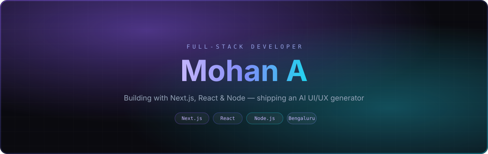

  

 

> I work across the MERN stack with a growing pull toward Next.js and TypeScript. Most of what I know, I learned by building first and reading the docs after — quiz apps, chat apps, AI-assisted tools, small UI experiments that grew into bigger ones.
>
> Right now I care most about how AI fits into real interfaces — not as a novelty, but as something that genuinely speeds up how people use a product.

 

## ✦ Now

<table width="100%">
<tr>
<td width="33%" valign="top">

**◆ Building**
AI UI/UX generator
in progress

</td>
<td width="33%" valign="top">

**◆ Shipped**
[AI Interview Platform](https://interview-app-ai.onrender.com/)
live · Gemini AI

</td>
<td width="33%" valign="top">

**◆ Learning**
Next.js App Router
system design

</td>
</tr>
</table>

 

## ✦ Stack

<table width="100%">
<tr>
<td width="25%" valign="top">

**Languages**
HTML · CSS · JS · TS Java · Python

</td>
<td width="25%" valign="top">

**Frontend**
React · Next.js Tailwind CSS

</td>
<td width="25%" valign="top">

**Backend**
Node.js · Express MongoDB

</td>
<td width="25%" valign="top">

**Tools**
Git · Docker AWS · Vercel

</td>
</tr>
</table>

 

## ✦ Work

<table width="100%">
<tr>
<td width="50%" valign="top">

### AI Interview Platform
SHIPPED · LIVE

AI-powered interview prep using Gemini AI to generate contextual questions and follow-ups in real time — not a static bank.

`React` `Node.js` `MongoDB` `Gemini AI`

[→ Live demo](https://interview-app-ai.onrender.com/) &nbsp; [→ Repo](https://github.com/Mohandev2004/Interview-App-AI)

</td>
<td width="50%" valign="top">

### UI/UX Design System
ACTIVE

Reusable, performance-minded UI components — practicing clean, maintainable frontend architecture.

`Next.js` `TypeScript` `Tailwind`

[→ Repo](https://github.com/Mohandev2004/UI-UX-Design)

</td>
</tr>
</table>

◆ Early builds

 

- [Chat Application](https://github.com/Mohandev2004/Chat-Application) — Java real-time chat
- [Quiz Application](https://github.com/Mohandev2004/Quiz-Application) — Java quiz/assessment app

 

## ✦ Principles

<table width="100%">
<tr>
<td width="25%" valign="top">CURIOSITY Pick something I don't fully understand yet, then build it.</td>
<td width="25%" valign="top">CRAFT Reusable components over quick hacks, even in side projects.</td>
<td width="25%" valign="top">AI Use it where it removes friction, not to check a box.</td>
<td width="25%" valign="top">SHIP A live demo beats a perfect plan.</td>
</tr>
</table>

 

Bengaluru, India · the.mohan@gmail.com

